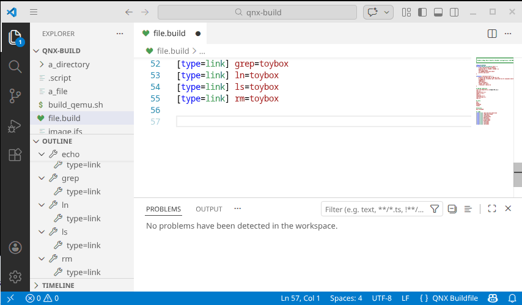

# Copying Directories in QNX Buildfiles Considered Harmful

If you work with QNX, you have written buildfiles. You have written lines like this:

```
/etc = /home/build/config
```

And if you have written lines like that in a production buildfile, you have a problem. You might not know it yet. You might not discover it until a target board refuses to boot at 2 AM during integration week, or until a safety audit asks you to explain exactly what is inside your IFS image — and you cannot.

This article explains why deploying entire directories from the host into a QNX IFS image is a dangerous pattern in embedded QNX development, why teams keep doing it anyway, and what to do instead.

<!-- ADD VISUAL: screenshot of a buildfile with type=dir highlighted, red squiggle warning -->

## What Happens When You Deploy a Directory

Let's start with what `mkifs` actually does when it encounters a directory deployment.

A typical QNX buildfile tells `mkifs` which files to include in the IFS (Image Filesystem) — the bootable image that the target hardware loads into RAM at startup. Most lines in a buildfile are explicit: they name a specific file on the host and a specific path on the target.

```
/proc/boot/slogger2 = slogger2
/proc/boot/devb-sdmmc = devb-sdmmc
[uid=0 gid=0 perms=0755] /usr/sbin/io-pkt-v6-hc = io-pkt-v6-hc
```

Each line is a contract. You know exactly what goes in. You can trace every file in the final image back to a specific artifact from your build system.

Now consider the directory deployment:

```
/etc = /home/build/config
```

If it just happens `/home/build/config` to be a directory on the host, this tells `mkifs` to recursively walk the host directory `/home/build/config` and copy **everything it finds** into `/etc` on the target. Every file. Every subdirectory. Whatever happens to be in that directory at the moment `mkifs` runs.

Read that again: **whatever happens to be in that directory at the moment `mkifs` runs.**

You don't control what's in that directory. Your build system does. Your colleagues do. Your CI pipeline does. A stale artifact from last Tuesday does. A debug configuration that someone forgot to clean up does. A core dump from a crashed unit test does.

And all of it ends up in your IFS image, on your target, in production.

## The Six Ways This Hurts You

### 1. Non-reproducible builds

The same buildfile, run twice on the same machine, can produce different IFS images. If a file was added to or removed from the source directory between builds, the output changes silently. There is no diff. There is no changelog. There is no error. The build succeeds, the image is different, and you have no idea why your Tuesday build works but your Wednesday build doesn't.

In automotive development, where traceability is not just a best practice but a regulatory requirement, this is not an inconvenience — it is a compliance failure. ISO 26262 requires that you can demonstrate exactly what software is deployed to each ECU. A directory wildcard is the opposite of that.

### 2. Image size bloat

Every unnecessary file in the IFS costs you RAM. The IFS is loaded entirely into memory at boot. On a resource-constrained embedded target — and in automotive, even "powerful" SoCs have tight memory budgets shared across dozens of processes — every kilobyte matters.

Directory deployments make it nearly impossible to audit image size. You see a 4 MB jump in image size between releases and start bisecting commits, only to discover that someone added a README and a set of unit test fixtures to a directory that happens to be swept into the IFS.

I have personally debugged a situation where an IFS image grew by 12 MB between builds. I found a `.git` directory. Yes, the content supposed to go in that directory was cloned from a git repository, and the whole .git directory was there.
The buildfile hadn't changed. The source code hadn't changed. But the image was 12 MB larger and boot time increased measurably.

### 3. Security surface expansion

Every file in the IFS is a file that can be accessed by processes on the target. Deploy a directory and you might include development scripts, build logs with paths and usernames, debug symbols that help an attacker understand your binary layout, or configuration files with credentials for test environments.

In a safety-critical system, the attack surface should be minimized. You should be able to enumerate every file on the target and justify its presence. Directory deployments make this impossible without manually inspecting the source directory at build time — which defeats the purpose of having a declarative buildfile in the first place.

### 4. Ordering and permission surprises

When you deploy files individually, you control their attributes explicitly:

```
[uid=0 gid=0 perms=0644] /etc/config/network.conf = output/config/network.conf
[uid=0 gid=0 perms=0600] /etc/config/secrets.conf = output/config/secrets.conf
```

When you deploy a directory, the attributes you set on the `[type=dir]` line apply to the **directory entry itself**, not necessarily to the files inside it. The files inherit default attributes. If your security model depends on specific files having specific permissions, then a directory deployment is a gamble.

Moreover, look at this experiment. In my buildfile, I may use macros or variables, such as:

```
[uid=MY_UID gid=${MY_GID}] /myfile = {
}
```
However, this is what happens if I do not define those macros or variables:

1. `mkifs` does not complain:
```
  42fca0        0     ----     ----     myfile=/tmp/mkxfs.eAcQ5X (4294967295)
```
2. `root` uid and gid (in this case) are applied:
```
Welcome to QNX OS 8.0!
# ls -la myfile 
-rw-r--r--  1 0 0 0 2026-02-18 22:30 myfile
```

### 5. Broken dependencies between images

In a multi-image QNX system — which is most real-world systems — you often have an IFS for early boot and one or more EFS (Embedded Filesystem) images or NFS mounts for the rest. Files deployed via directory copy might depend on libraries or resources that aren't in the IFS yet, because those are expected to come from the EFS. But since you don't explicitly list the files, you don't see the dependency. The system boots, the IFS loads, a process starts from `/etc/config/startup.sh`, and it fails because it references `/opt/lib/libfoo.so` which is on the EFS that hasn't mounted yet.

With explicit file deployments, this dependency is visible in the buildfile itself. With directory deployments, it is hidden inside the content of the directory.

### 6. Silent failures in CI

This is perhaps the most insidious problem. Your CI pipeline builds the IFS image. It succeeds. Every build succeeds. The buildfile is syntactically valid. `mkifs` runs without errors. But the image contains the wrong files, or extra files, or is missing files that were removed from the directory. There is no failure signal.

CI is supposed to catch problems before they reach the target. With directory deployments, CI becomes a rubber stamp. It certifies that `mkifs` ran, not that the image is correct.

<!-- ADD VISUAL: diagram showing the "hidden path" — build artifacts flowing uncontrolled into IFS via directory copy -->

## Why Teams Do It Anyway

If directory deployments are so problematic, why does every QNX project have at least one?

**Convenience.** Writing one line is faster than writing fifty. When a directory has dozens of configuration files that change frequently, maintaining an explicit list feels like busywork. Developers add a file to the directory and it appears on the target automatically — no buildfile change needed, no PR for the buildfile, no merge conflict.

**Legacy.** The buildfile was written years ago by someone who is no longer on the team. It works. Nobody wants to touch it. The directory deployment has survived three product generations because nobody has been burned by it yet — or because the burns were attributed to other causes.

**Lack of tooling.** Until recently, there was no way to statically analyze a QNX buildfile. Not that I'm aware of. You could not lint it, you could not validate it, you could not run it through CI with anything smarter than "did mkifs exit 0?" So antipatterns like directory deployments were invisible.

## How to Detect Directory Deployments

The rule for detecting a problematic directory deployment is more nuanced than "find all `type=dir` lines." You can have situation in two cases:

1. The deployment statement has `type=dir` in its attribute section **and**  has a *source path* (content after the `=`)
2. Alternatively, the deployement has no `type=dir` but the source path **is** a directory on the host.

The second case is even worse, since potentially any deployement statement with a source path is about copying a directory, and it can be verified only during the build, not a-priori looking only at the buildfile.

If there is no source path, however, you have an empty directory creation, which is perfectly fine — that is how you ensure `/var/run` or `/tmp` exists on the target.

Here is the distinction:

```
# FINE: creates an empty directory on the target
[type=dir] /var/run

# FINE: creates an empty directory with specific permissions
[type=dir uid=0 gid=0 perms=0755] /var/log

# DANGEROUS: copies everything from the host directory into the target
[type=dir] /etc = /home/build/config

# DANGEROUS: even with explicit permissions on the directory itself and unrecognizable without type=dir
[uid=0 gid=0 perms=0755] /opt/plugins = ${STAGE_DIR}/plugins
```

Note the last example: the variable `${STAGE_DIR}` makes it even harder to reason about what gets deployed, because even the path of content depends on the environment at build time.

## How to Fix It: Replace Directories with Explicit File Deployments

The fix is straightforward in concept and tedious in practice: enumerate every file in the directory and deploy each one explicitly.

Before:

```
/etc = /home/build/config
```

After:

```
[uid=0 gid=0 perms=0644] /etc/network.conf = /home/build/config/network.conf
[uid=0 gid=0 perms=0644] /etc/system.conf = /home/build/config/system.conf
[uid=0 gid=0 perms=0600] /etc/auth.conf = /home/build/config/auth.conf
```

Yes, it is more lines. Yes, you need to update the buildfile when you add a configuration file. That is the point. **The update is a conscious decision**. It goes through code review. It appears in the git log. It is traceable.

### But what about directories with hundreds of files?

Some teams deploy plugin directories or resource directories with dozens or hundreds of files. Enumerating them manually is genuinely impractical.

There are several approaches:

**Generate the buildfile.** Write a script that scans the directory and generates the deployment lines. Run it as part of your build. Now the buildfile is generated from the actual build output, it is deterministic, and you can diff it between builds. If a file was added or removed, you see it in the generated diff.

**Split the buildfile.** `mkifs` supports `[module]` and `[virtual]` directives, and you can use shell-level `#include` or simply concatenate buildfile fragments. Put the generated file list in a fragment and include it from the main buildfile.

**Use a validator to detect the problem and generate the replacement.** The `standalone-validator` example in the [qnx-buildfile-lang](https://github.com/gvergine/qnx-buildfile-lang) project does exactly this: it detects directory deployments, walks the source directory on the host, and outputs the equivalent per-file deployment lines. You can use this output as a starting point:

```bash
java -jar standalone-validator.jar -r suggestions.txt my.build
```

The report will include lines like:

```
WARNING in my.build: Directory deployment: /etc = /home/build/config
  Suggestion — replace with individual file deployments:
    /etc/auth.conf = /home/build/config/auth.conf
    /etc/network.conf = /home/build/config/network.conf
    /etc/system.conf = /home/build/config/system.conf
```

## Beyond Detection: The Full Validation Pipeline

Directory deployments are one class of buildfile problems, but they are far from the only one. In practice, the buildfile bugs that cause the most grief are the mundane ones: a typo in an attribute name, a `perms` value that doesn't match the expected format, a path that is deployed twice with different attributes, a `${VAR}` reference that isn't set in the build environment.

A robust buildfile validation pipeline catches these **before** `mkifs` runs — and ideally before the code is even committed. Here is the pipeline that I use and recommend:

### Step 1: Parse the buildfile

Load the buildfile into a structured model. This catches syntax errors: unclosed brackets, malformed attribute sections, missing paths. These are the errors that `mkifs` itself would catch, but a parser gives you the errors immediately in your editor instead of ten minutes into a build.

### Step 2: Substitute variables

Replace `${VAR}` references with their values from the environment. This is critical because many validation checks are meaningless on unsubstituted text. Is `/usr/lib` a valid path? Yes. Is `${STAGE_DIR}/lib` a valid path? You can't know until you resolve `${STAGE_DIR}`.

Variable substitution also lets you detect undefined variables early. If `${VARIANT}` is not set in the environment and your buildfile references it, you want to know now — not when `mkifs` silently produces an image with wrong paths.

### Step 3: Validate attributes

Check that every attribute name is a known `mkifs` attribute. Check that values conform to their expected types: `perms` should be an octal number, `uid` and `gid` should be numeric, `type` should be one of `file`, `dir`, `link`, or `fifo`.

This catches typos like `[perm=0755]` (should be `perms`) or `[tpye=link]` (should be `type`) that `mkifs` would either silently ignore or interpret in unexpected ways.

### Step 4: Check for duplicate paths

If two deployment statements target the same path, one overwrites the other. This is almost always a mistake — either a copy-paste error or a merge conflict that was resolved incorrectly. Flag it.

### Step 5: Detect directory deployments

As described above: find statements with a source path that is a directory and flag them.

### Step 6: Custom project-specific checks

Every project has its own conventions. Maybe all binaries must go under `/proc/boot`. Maybe `perms=0777` is forbidden. Maybe certain paths are reserved. A custom validator lets you encode these rules and enforce them automatically.

This is where the extensible validator architecture of `qnx-buildfile-lang` comes in. You write a custom validator JAR with your project-specific rules, and the pipeline loads it alongside the standard checks:

```java
public class MyProjectValidator extends BaseDSLValidator {

    @Check
    public void noWorldWritable(DeploymentStatement ds) {
        // Forbid perms=0777 in production buildfiles
        if (ds.getAttributesection() == null) return;
        ds.getAttributesection().getAttributes().forEach(attr -> {
            if (attr instanceof ValuedAttribute va) {
                if ("perms".equals(va.getName()) && "0777".equals(va.getValue())) {
                    warning("World-writable permissions are not allowed",
                        ds, BuildfileDSLPackage.Literals.DEPLOYMENT_STATEMENT__PATH,
                        "worldWritable");
                }
            }
        });
    }
}
```

Compile this into a JAR, pass it to the validator with `-c`, and it runs alongside all the standard checks. Your team's conventions become enforceable rules, not just wiki pages that nobody reads.

<!-- ADD VISUAL: pipeline diagram showing Parse → Substitute → Validate → Analyse → Report -->

## Putting It in CI

The entire pipeline above can run in CI with a single command:

```bash
java -jar standalone-validator.jar \
    --strict-vars \
    -W \
    -c my-project-validator.jar \
    -r validation-report.txt \
    src/ifs/*.build
```

This command:

- Resolves all `${VAR}` references from the CI environment
- Fails the build if any variable is undefined (`--strict-vars`)
- Fails the build on warnings, not just errors (`-W`)
- Loads your project-specific validation rules (`-c`)
- Writes a report for archival and auditing (`-r`)
- Validates every `.build` file in the directory

Add this as a CI step **before** `mkifs`. Now your CI pipeline catches buildfile problems at the validation level, not at the "image doesn't boot" level.

The exit code is 0 for success, 1 for any failure. Standard Unix convention: it plugs directly into any CI system — Jenkins, GitLab CI, GitHub Actions, Bamboo, whatever you use.

## Integrating Into Your Editor

If you don't want to wait for CI, you can catch these problems as you type.

The [qnx-buildfile-lang](https://github.com/gvergine/qnx-buildfile-lang) project provides editor plugins for both VS Code and Eclipse that run the same validation pipeline in real time:

- **Red squiggles** on unknown attribute names, with quickfix suggestions for typos
- **Warnings** on duplicate deployment paths
- **Content assist** for attribute names and values — no more guessing whether it's `perm` or `perms`
- **Outline view** showing the structure of your buildfile at a glance
- **Syntax highlighting** for attributes, paths, variables, and comments



The VS Code extension connects via LSP (Language Server Protocol), so the validation runs in the background as you edit. The moment you type `[tpye=link]`, you see the error. The moment you type `[`, content assist offers you the complete list of valid attributes. The moment you type a path that already exists elsewhere in the file, you see the duplicate warning.

For the directory deployment check specifically, you can load the custom validator JAR via the VS Code settings (`qnx-buildfile-lang.customValidatorJarPath`), and the editor will show the "Copying whole directories from host is considered harmful" warning inline as you edit.

## The Bigger Picture: Buildfiles Deserve the Same Rigor as Source Code

QNX buildfiles define what runs on your target. They define the filesystem layout, the permissions model, the process startup order, the library search paths. In a safety-critical embedded system, the buildfile is as important as the source code.

Yet in most QNX projects, buildfiles are treated as second-class citizens. They are not linted. They are not validated in CI. They are edited by hand with no content assist. They are reviewed casually if at all, because reviewers don't have the tools to understand them quickly.

The directory deployment problem is a symptom of this broader issue. Teams use directory deployments because they lack the tooling to manage explicit deployments efficiently. They don't validate their buildfiles because until recently there was no validator. They don't audit their IFS images because the process is manual and tedious.

The tools exist now. Use them.

---

*Giovanni Vergine is a software engineer working on automotive embedded systems.*

*[qnx-buildfile-lang](https://github.com/gvergine/qnx-buildfile-lang) is an open-source toolkit for QNX buildfile parsing, validation, and analysis — available as a VS Code extension, Eclipse plugin, CLI tool, and Java library on [Maven Central](https://central.sonatype.com/search?q=qnx.buildfile.lang). It is listed on the [QNX Community Projects](https://gitlab.com/qnx/projects) page.*
