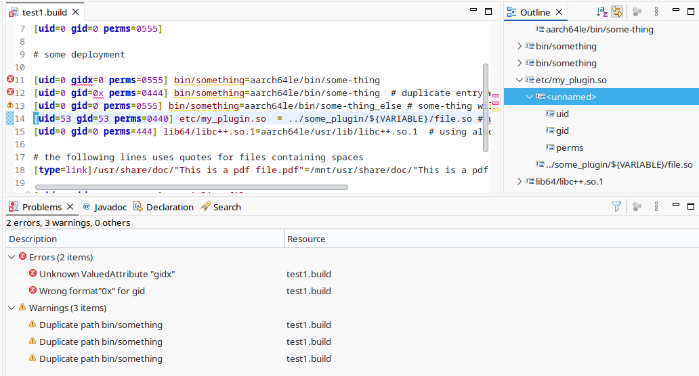

# qnx-buildfile-lang
*An [Xtext](https://eclipse.dev/Xtext/documentation/)-based grammar for parsing and validating [QNX buildfiles](https://www.qnx.com/developers/docs/8.0/com.qnx.doc.neutrino.building/topic/buildfiles/buildfile_syntax.html)*

---
*The rest of this README is for developers who want to use the grammar in their daily work. If you are a developer that wants to contribute to the grammar, please go to [https://github.com/gvergine/qnx-buildfile-lang](https://github.com/gvergine/qnx-buildfile-lang)*


## Overview

Working with QNX buildfiles can be error-prone and time-consuming. Syntax or semantic issues often show up late in the build process, slowing developers down and making debugging harder. It is often a struggle to enforce systematically additional (e.g. security) policies as an automatic quality gate.

**qnx-buildfile-lang** solves this by providing:

- **A complete Xtext grammar** for QNX buildfiles  
- **Instant syntax validation** inside Eclipse  
- **A standalone Maven library** that enables programmatic parsing, additinal opportunities for semantic validation, automation, and CI checks. 

This project was built to make QNX development smoother, more reliable, and more automatable for teams working on embedded or automotive platforms.

---

##  Key Features

- **QNX buildfile grammar** implemented using Xtext

- **Eclipse Plugin**
  - Syntax highlighting  
  - Real-time syntax validation  
  - Better readability and safer editing 
   
- **Standalone Maven Library**
  - Enables parstng of buildfiles programmatically  
  - Integrate into custom tooling  
  - Add validation to CI/CD pipelines

- **Distributed via [Maven Central](https://mvnrepository.com/artifact/io.github.gvergine/qnx.buildfile.lang/1.0.4)**

- **Lightweight, dependency-friendly, and easy to integrate**

---

## Install & Use

### **As Eclipse Plugin**

1. Download the plugin ZIP from [Maven Central](https://repo1.maven.org/maven2/io/github/gvergine/qnx.buildfile.lang.repository/1.0.4/qnx.buildfile.lang.repository-1.0.4.zip).  
2. In Eclipse:  
   *Help → Install New Software → Add → Archive…*  
3. Select the ZIP file and proceed with installation 
4. Restart Eclipse and open any QNX `.build` file to enjoy syntax checking and highlighting.

*Remember to allow the Xtext Nature to your Eclipse project*



*Support for Momentics IDE is work in progress*

---

### **As a Maven Dependency**

```xml
<dependency>
  <groupId>io.github.gvergine</groupId>
  <artifactId>qnx.buildfile.lang</artifactId>
  <version>1.0.4</version>
</dependency>
```
Or any latest release, check which one at [Sonatype](https://central.sonatype.com/artifact/io.github.gvergine/qnx.buildfile.lang).

This is an example of a standalone parser:
```java
import qnx.buildfile.lang.BuildfileDSLStandaloneHelper;
import org.eclipse.xtext.validation.Issue;

// ...

BuildfileDSLStandaloneHelper buildfileDSLStandaloneHelper = new BuildfileDSLStandaloneHelper();

// ...

File file = new File(filename);
BuildfileDSLStandaloneHelper.ParsingResult parseResult = buildfileDSLStandaloneHelper.parse(file);        	

if (parseResult.hasErrors())
  // ...
```

Full example of a standalone command line interface at [qnx.buildfile.lang.cli](https://github.com/gvergine/qnx-buildfile-lang/blob/master/qnx.buildfile.lang.parent/qnx.buildfile.lang.cli/src/main/java/qnx/buildfile/lang/cli/Main.java).

Ready-to-use executable jar for command line validation is available as [qnx.buildfile.lang.cli-1.0.4-shaded.jar](https://repo1.maven.org/maven2/io/github/gvergine/qnx.buildfile.lang.cli/1.0.4/qnx.buildfile.lang.cli-1.0.4-shaded.jar) (java 17+ required):

```
$ java -jar qnx.buildfile.lang.cli-1.0.4-shaded.jar -i path/to/first.build -i path/to/second.build 
This is the QNX Buildfile Validator version 1.0.4
Processing path/to/first.build
Processing path/to/second.build
Done - 0 failures
$ echo $?
0
```

---

## Use Cases
- Developers working with custom QNX buildflows

- CI pipelines that validate buildfiles before builds

- Static analysis or tooling around QNX images

- Teams onboarding new developers onto QNX build systems

- Automotive and embedded companies with QNX-based projects

##  Roadmap

- Improve grammar coverage and corner-case handling

- Investigate Momentics compatibility

- Add code completion and handling of environment varlanbles

- Add real-world sample build projects


If you want to contribute ideas or fixes — PRs and feature requests are very welcome!

## Author

Created and maintained by Giovanni Vergine - contact me via Github Issues or at [my Linkedin](https://www.linkedin.com/in/giovanni-vergine/)
